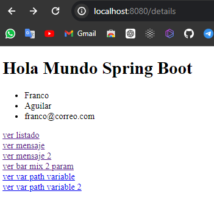
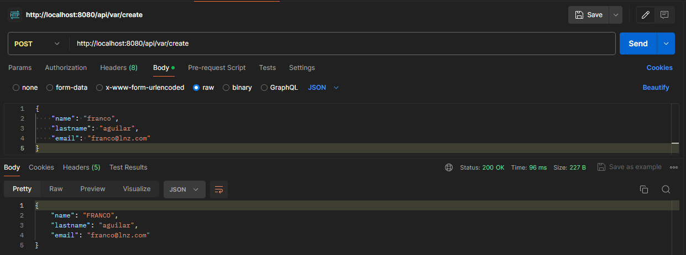
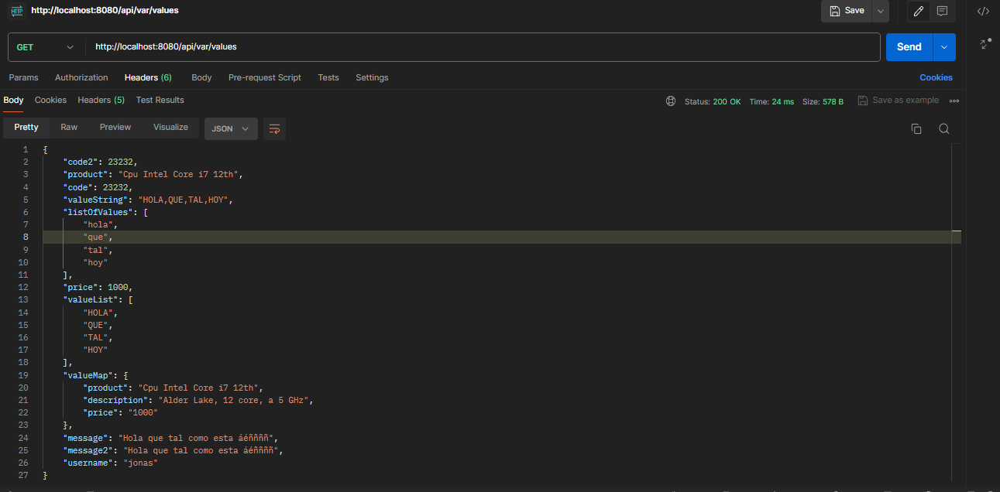

# Utilizando Spring MVC con Thymeleaf
## Descripción del proyecto

Este proyecto es una aplicación web básica construida con Spring MVC y Thymeleaf. 

Proporciona una estructura de ejemplo para empezar a desarrollar aplicaciones web robustas y mantenibles en Java.

## Características

- **Spring MVC**: Para la gestión de solicitudes y la lógica del controlador.
- **DTOs**: Para el transporte de datos de manera estructurada y segura.
- **Thymeleaf**: Para la renderización de vistas.
- **Maven**: Para la gestión de dependencias.
- **Spring Boot**: Para facilitar la configuración y el despliegue de la aplicación.

## Recursos
El proyecto esta creado con las siguientes tecnologías, las primeras 3 se obtienen
al momento de crear el proyecto.

| Plugin                |
|-----------------------|
| Spring Web            | 
| Spring Boot DevTools  | 
| Thymeleaf             |


## Uso en el navegador y Postman

Muestra las plantillas Html y el formato JSON.

Copiar en el navegador.

```sh
http://localhost:8080/details
```

**GET**

| Enlaces                | URL                      |
|------------------------|--------------------------|
| ver listado            | http://localhost:8080/list |
| ver mensaje            | http://localhost:8080/api/params/foo?message=muchogusto |
| ver mensaje 2          | http://localhost:8080/api/params/foo(message='Hola que tal festival') |
| ver bar mix 2 param    | http://localhost:8080/api/params/bar?text=Hey&code=420 |
| ver var path variable  | http://localhost:8080/api/var/baz/hola buenos dias |
| ver var path variable 2| http://localhost:8080/api/var/baz/hola buenos dias |




**POST**




### Utilizando valores personalizados

Los valores se encuentran *src/main/resources/values.properties* y son mostradas en formato __JSON__.

